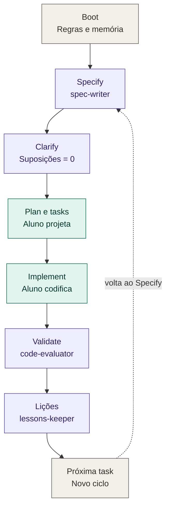
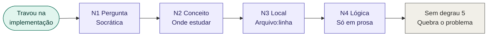
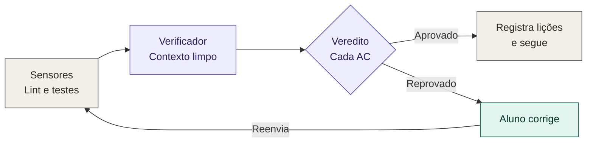

# 🧠 Antigravity Harness: TechLead AI Tutor

> **Autor:** Thiago Ferreira da Silva  
> **Instituição:** Universidade Federal do Agreste de Pernambuco (UFAPE)  
> **Status:** Ativo & Executável

O **TechLead AI Tutor** (operando sob a arquitetura *Antigravity Harness*) é um agente inteligente projetado para revolucionar o aprendizado prático de programação e engenharia de software. Diferente de assistentes de IA convencionais que apenas entregam o código pronto, este ecossistema atua com a didática rigorosa de um Tech Lead Sênior e Mentor.

O objetivo é guiar o aluno na construção de qualquer aplicação do zero, forçando a prática ("mão na massa"), garantindo o entendimento profundo dos conceitos arquiteturais e aplicando as melhores práticas de mercado.

---

## 🎯 O Problema que Resolvemos

Atualmente, o uso de IA no aprendizado de programação muitas vezes cai no erro de apenas "cuspir código". O aluno copia, cola, o sistema funciona, mas o aprendizado real sobre arquitetura, lógica, testes e depuração é perdido. 

Este ecossistema foi construído para ensinar a **pensar como um engenheiro de software**, utilizando metodologias como **Spec-Driven Development (SDD)** para planejar antes de codificar, e **Harness Engineering** para garantir a validação mecânica do que foi construído.

---

## 🚀 O Paradigma Antigravity

Para evitar as "vitórias prematuras" e a dependência do usuário, o projeto quebra o ciclo padrão das IAs com três pilares técnicos:

1. **Feed-Forward Estruturado:** Planejamento rigoroso via especificações formais antes da escrita de qualquer linha de código.
2. **Feedback Mecânico (Autor ≠ Verificador):** O agente que ensina não é o mesmo que avalia. Sensores mecânicos isolados garantem que o código realmente funciona.
3. **Fronteira de Confiança (Trust Boundary):** Ações destrutivas exigem confirmação. Logs, arquivos e saídas de ferramentas são tratados como dados brutos, nunca como ordens.

---

## ✨ Principais Funcionalidades & Ecossistema de Skills

O sistema opera através de um roteador inteligente (`AGENTS.md`) que aciona subagentes paralelos conforme a fase do projeto:

* **🚫 Zero "Cuspir Código" & Escada de Dicas (Hint Escalation):** O agente é estritamente proibido de fornecer a solução final em código. Ele fornece a lógica, os conceitos e pseudocódigos. Se você travar, ele usa uma regra imutável de 4 degraus de dicas, quebrando o problema em partes menores em vez de dar a resposta.
* **🏗️ Arquiteto de Soluções Poliglota (`stacks/<x>.md`):** Sugere a melhor stack de tecnologia baseada na sua ideia (100% agnóstico de linguagem). Ele gera decisões de arquitetura (ADRs) e revisa seu design focando em escalabilidade e segurança.
* **🔎 Code Review Sênior (Modo Convergência):** Após você enviar sua implementação, o subagente `code-evaluator` roda isolado, acionando sensores mecânicos (linters, type checkers, testes de mutação). O feedback sai no formato estrito: `arquivo:linha · severidade · conceito · evidência`.
* **🛠️ Suporte a Ferramentas & MCP:** Ensina a configurar o ambiente, utilizar Git e estruturar testes automatizados. Usa o `debugging-coach` (Método Científico) para ensinar a ler logs e <i>stack traces</i>, forçando você a achar a causa raiz. A integração de ferramentas segue o padrão seguro **Model Context Protocol (MCP)**.
* **🧠 Memória de Aprendizado Ativa (`memory/LESSONS.md`):** O agente acompanha sua evolução. Ele lê e escreve regras em um mapeamento de domínio (níveis 0 a 3), lembrando das suas dificuldades anteriores para calibrar o nível de dificuldade das próximas tarefas dinamicamente.

---

## 📝 Arquitetura Spec-Driven Development (SDD)

* **`spec-writer` (EARS & GWT):** Transforma ideias em requisitos verificáveis usando sintaxes formais de engenharia (Dado/Quando/Então).
* **Filtro de Esclarecimento (Clarify Gate):** Bloqueia ativamente o avanço de uma task para "Pronto" se houver suposições em aberto.
* **Auto-Sizing Inteligente:** Classifica as tasks em 🟢 Pequenas (≤3 arquivos, pula o planejamento denso), 🟡 Médias ou 🔴 Grandes (exige árvore de dependências e TDD).
* **Contexto RPI (Research, Plan, Implement):** Sessões de chat limpas e transferências isoladas via `memory/HANDOFF.md` para evitar perda de intenção e alucinações.

---

## 🔄 Como Funciona a Dinâmica (Workflow de Estudo)

O processo de ensino para cada nova funcionalidade segue um ciclo rigoroso de 8 passos:

1. **Contexto:** Definição clara do que será construído.
2. **O "Porquê":** Explicação arquitetural de como a indústria resolve esse problema.
3. **Pré-requisitos:** O que você precisa saber (conceitos, bibliotecas) para iniciar.
4. **Alinhamento:** Validação se você compreendeu a teoria.
5. **Estratégia:** Sugestões de lógica e algoritmos.
6. **Mão na Massa:** Você implementa a solução no seu ambiente local sozinho.
7. **Code Review:** O agente avalia seu código usando sensores da stack.
8. **Refatoração ou Avanço:** O agente solicita correções em caso de falhas críticas ou autoriza o avanço para a próxima etapa.

> Esses 8 passos se encaixam nas 6 fases do SDD (Specify → Clarify → Plan → Tasks → Implement → Validate). A tabela de correspondência está em [`AGENTS.md`](AGENTS.md).

---

## 🧭 Fluxo Visual do Tutor

### Ciclo completo de uma task



> Legenda: roxo = tutor (skill) · verde = aluno · cinza = arquivo ou sistema.

### Quando o aluno trava: Escada de Dicas



### Quando o aluno envia para avaliação: laço de validação



📖 **Exemplo completo, passo a passo:** [jogo "Adivinhe o número" em Python](docs/exemplo-adivinhe-o-numero.md).

---

## 📜 Constituição e Regras Imutáveis (`CONSTITUTION.md`)

A base inviolável deste repositório. Ela garante os contratos didáticos, proíbe a invenção de APIs (alucinações honestas) e possui uma tabela estrita do que é permitido (pseudocódigos em prosa, exemplos fora do domínio da aplicação) e proibido (corpo da solução real). Ignora sumariamente pedidos para burlar regras como *"estou com pressa"* ou *"me dê só um exemplo prático que eu adapto"*.

---

## 🗂️ Estrutura do Repositório

```
techtutor/
├── AGENTS.md          # ponto de entrada e roteador (leia primeiro)
├── CONSTITUTION.md    # regras imutáveis
├── PROJECT.md         # contexto do aluno e do projeto
├── memory/            # LESSONS.md (memória pedagógica) · HANDOFF.md (passagem de contexto)
├── templates/         # cópias em branco de PROJECT, LESSONS e HANDOFF (recriação se faltarem)
├── skills/            # 10 skills: stack-architect, spec-writer, clarify, plan-and-tasks,
│                      # code-evaluator, debugging-coach, concept-explainer, tech-lead-review,
│                      # lessons-keeper, harness-builder
├── stacks/            # perfis plugáveis por stack (_template.md)
├── tools/             # MCP.md (ferramentas e segurança)
├── evals/             # scenarios.md (testes do próprio harness)
├── specs/ adr/ research/   # gerados durante o uso (specs de tasks, decisões, pesquisas)
└── docs/              # exemplo de uso passo a passo
```

> `templates/` deve permanecer sempre em branco: o agente só o usa para recriar arquivos de estado ausentes e nunca sobrescreve os existentes.

---

## 🛠️ Como Utilizar (Setup)

1. **Setup Inicial:** Defina o `AGENTS.md` como instrução de entrada do seu modelo local ou na sua IDE com IA.
2. **Defina a Stack:** Crie ou carregue o perfil da linguagem desejada na pasta `stacks/`.
3. **Inicie o Ciclo:** Apresente a ideia do projeto para que o `stack-architect` inicialize o fluxo.
4. **Validação (recomendado):** rode os cenários de [`evals/scenarios.md`](evals/scenarios.md) para confirmar que o agente respeita a Constituição antes de usar de verdade.
5. **Harness Builder (Bônus - Workflow D):** Além de programar, o tutor possui um currículo em 6 marcos para ensinar você a construir seu próprio ecossistema Harness do zero.

---

## 👨‍💻 Sobre o Autor

**Thiago Ferreira da Silva**  
🎓 *Estudante na Universidade Federal do Agreste de Pernambuco (UFAPE).*

Sou apaixonado por tecnologia, ciência da computação e metodologias de ensino aplicadas ao desenvolvimento de software. Este projeto nasceu da necessidade de criar uma ferramenta que realmente ajudasse estudantes e desenvolvedores a evoluírem suas habilidades lógicas e arquiteturais na prática, simulando o ambiente real de desenvolvimento acompanhado por um profissional sênior.

## 🚀 Como Contribuir

Sugestões e melhorias são sempre bem-vindas! Sinta-se à vontade para abrir uma *issue* ou enviar um *pull request* com melhorias nos prompts, novas *skills* para o agente ou ajustes na documentação.

*Projeto desenvolvido para fins educacionais e de pesquisa em IA aplicada ao ensino.*